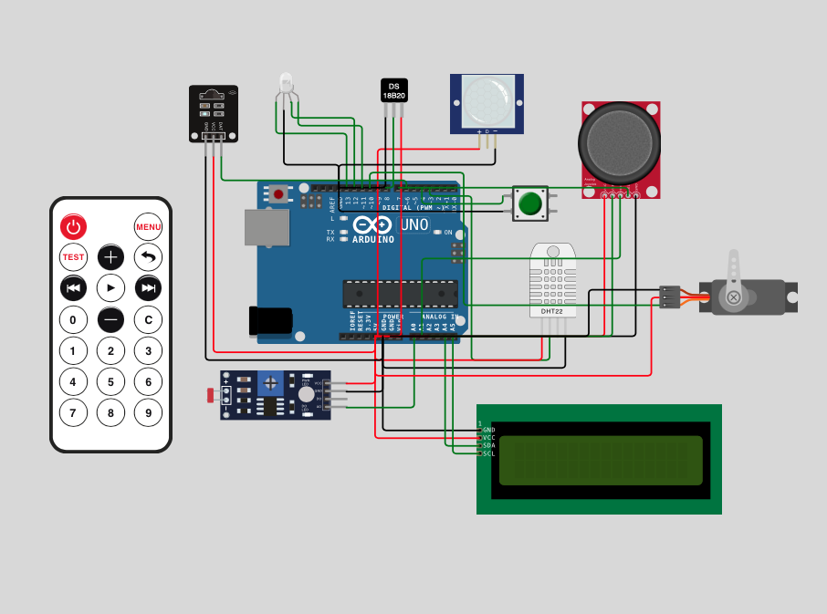
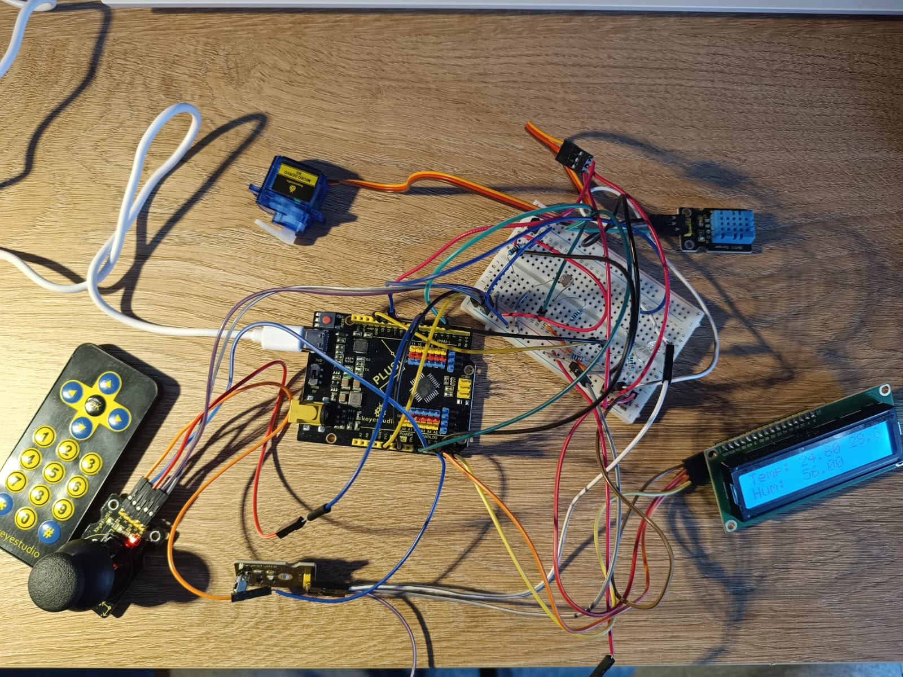
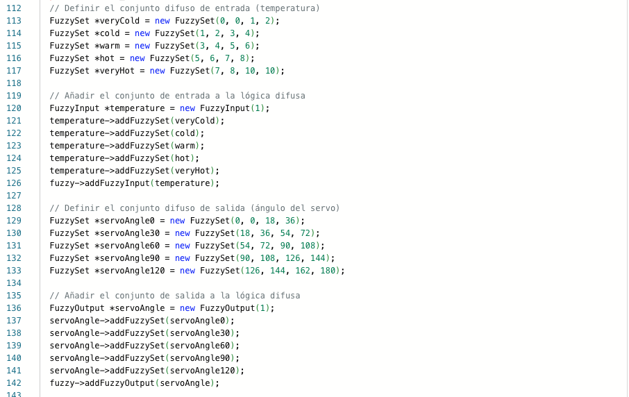
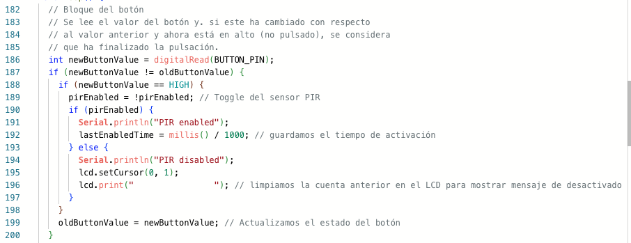
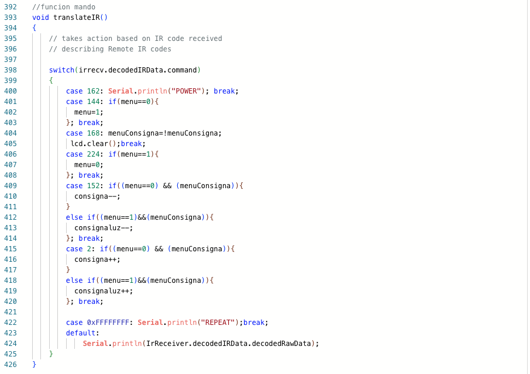

# Actividad_3_Equipos_e_Instrumentacion
Actividad 3 de la asignatura de Equipos e Instrumentación del master de Ingeniería de Telecomunicación de la UNIR. Esta actividad esta realizada por:

- Francisco Javier Hernántes Luaces
- Javier Lluch Sanz
- Marta Garcia Benzal
- Jesús Fernández Funcia

## Hardware
### Diagrama de conexiones
En la imagen inferior se puede observar el diagrama de conexiones de esta práctica.

### BOM (Bill of materials)
En el fichero .txt [BOM](BOM "Bill of materials") se muestra una tabla con la lista de componentes empleados en este ejercicio, su fabricante y su número de referencia.

### Fotografía del circuito
En la fotografía inferior se puede observar la reconstrucción del sistema para regular la temperatura.

## Firmware
### Código comentado
En la carpeta [code](code "codigo") se encuentra el archivo .ino con el código comentado que se ha empleado para desarrollar esta práctica.

## Pruebas de Validación
### Simulación de wokwi
Si se pincha en este [enlace](https://wokwi.com/projects/400202610798134273 "wokwi") se dirigirá la simulación del circuito en la plataforma Wokwi.
### Pruebas con el circuito
En este [enlace](https://drive.google.com/file/d/13qZfG0QAxgeHiCLZxAjfVpgD4lqHaW6A/view?usp=drive_link "Video") se encuentra un video que muestra el funcionamiento de la actividad realizada por este grupo.

## Snippets

En este apartado se muestran algunas partes del código que facilitan el entendimiento del mismo.

### Entrada y salida difursa
En la imagen inferior se puede observar el conjunto de entrada y salida para la lógica difusa.

### Definción del botón
En la imagen inferior se puede observar la función que maneja el control del botón.

### Definción del mando
En la imagen inferior se puede observar la función que maneja el control del mando.
